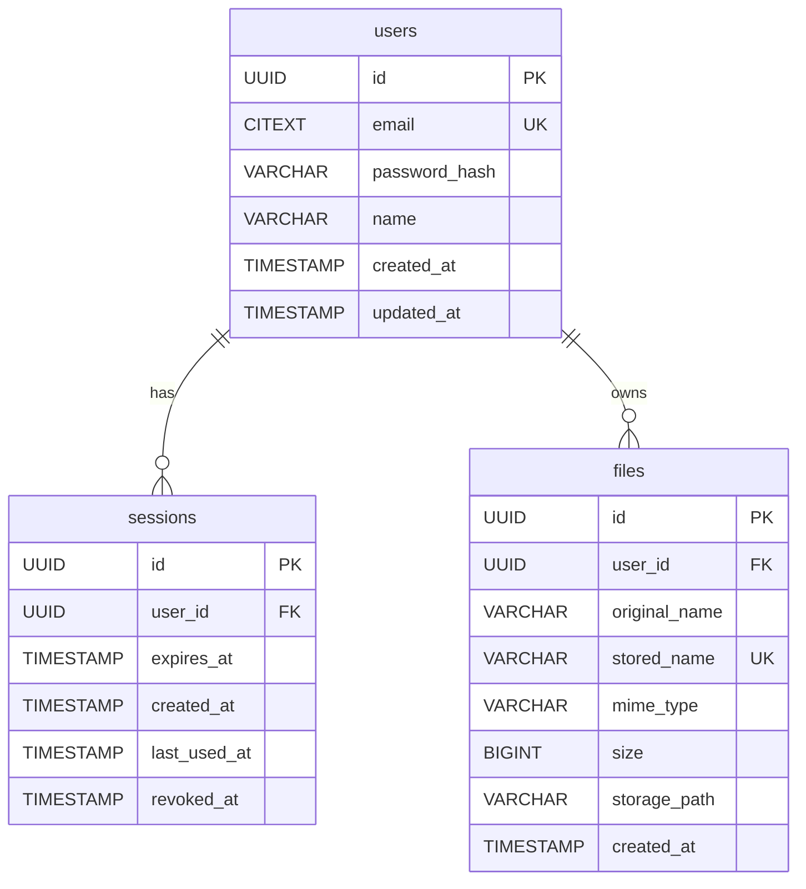

# Database Documentation

## Overview
The custom backend implementation utilizes PostgreSQL (hosted by Supabase). 
The database serves as the source of truth for the application state. It enforces data integrity, relationships, and uniqueness using native SQL features.

## Entity Relationship Overview

## Connection Architecture
The application connects to PostgreSQL using the `pg` driver and a `Pool` instance. The connection pool manages multiple simultaneous connections to improve performance. The `DATABASE_URL` is provided securely through environment variables and is never checked into source control. 

## Migration Strategy
We use `node-pg-migrate` to manage deterministic, raw SQL migrations. Every schema change is represented as an UP/DOWN migration script in the `migrations/` directory.

## Constraints & Security
- `user_id` is the fundamental ownership reference across all tables.
- Foreign Keys use `ON DELETE CASCADE` to prevent orphaned files or sessions when a user is deleted.
- Emails are stored as `CITEXT` to provide case-insensitive uniqueness at the database level.
- Authentication secrets are isolated to `password_hash`. Plaintext passwords are NEVER stored.
- Explicit `CHECK (size > 0)` constraint exists on files to prevent zero-byte garbage entries.
